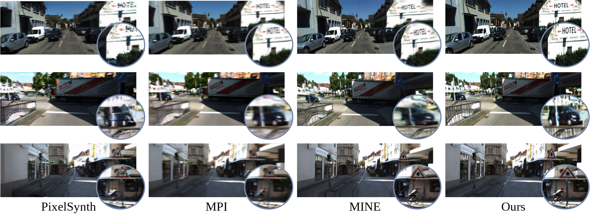
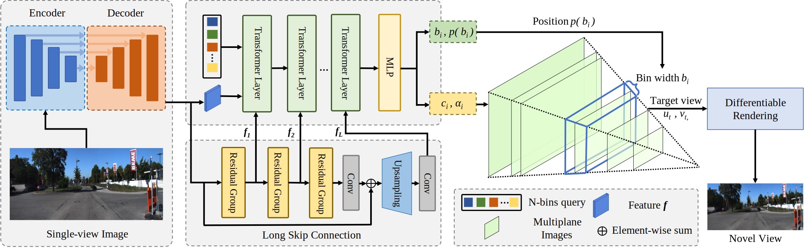

# SAMPLING [arXiv](https://arxiv.org/abs/2309.06323)
The official code for [SAMPLING: Scene-adaptive Hierarchical Multiplane Images Representation for Novel View Synthesis from a Single Image (ICCV23)](https://arxiv.org/abs/2309.06323).

## Overview
Given a single image captured in an outdoor scene, our method synthesizes novel views with fewer visual artifacts, geometric deformities, and blurs. Notably, our method models favorable intricate details, such as tiny objects, symbols, and traffic signs, resulting in more photo-realistic views.


## SAMPLING
Recent novel view synthesis methods obtain promising results for relatively small scenes, e.g., indoor environments and scenes with a few objects, but tend to fail for unbounded outdoor scenes with a single image as input. In this paper, we introduce SAMPLING, a Scene-adaptive Hierarchical Multiplane Images Representation for Novel View Synthesis from a Single Image based on improved multiplane images (MPI). Observing that depth distribution varies significantly for unbounded outdoor scenes, we employ an adaptive-bins strategy for MPI to arrange planes in accordance with each scene image. To represent intricate geometry and multi-scale details, we further introduce a hierarchical refinement branch, which results in high-quality synthesized novel views. Our method demonstrates considerable performance gains in synthesizing large-scale unbounded outdoor scenes using a single image on the KITTI dataset and generalizes well to the unseen Tanks and Temples dataset.


## Performance
Qualitative results

Video results

## Quick Start
### Installation
```
cd SAMPLING
pip install -r requirements.txt
```
### Data preparation
Download KITTI dataset images and labels, with data structure as below:
```
${ROOT}
  |-- data
  `-- |-- kitti
      `-- |-- image
          |   |-- training
          |   |-- |-- image_00
          |   |-- |-- |-- 0000
          |   |-- |-- |-- ...
          |-- |-- testing
          |-- label
          |   |-- 0000.txt
          |   |-- ...
          `-- calib
```
### Training
```
python train.py
```
### Inference
```
python synthesis_task_kitti.py
```
### Visualization
```
python visualizations/image_to_video.py
```
Please note that the code is built based on [MINE](https://github.com/vincentfung13/MINE),  we thank the authors for their great effort.

## Citation
If you find this repo useful in your research, please consider citing the following paper:
```
@article{zhou2023sampling,
  title={SAMPLING: Scene-adaptive Hierarchical Multiplane Images Representation for Novel View Synthesis from a Single Image},
  author={Zhou, Xiaoyu and Lin, Zhiwei and Shan, Xiaojun and Wang, Yongtao and Sun, Deqing and Yang, Ming-Hsuan},
  journal={ICCV},
  year={2023}
}
```

## License 
The project is only free for academic research purposes, but needs authorization for commerce. For commerce permission, please contact wyt@pku.edu.cn.
